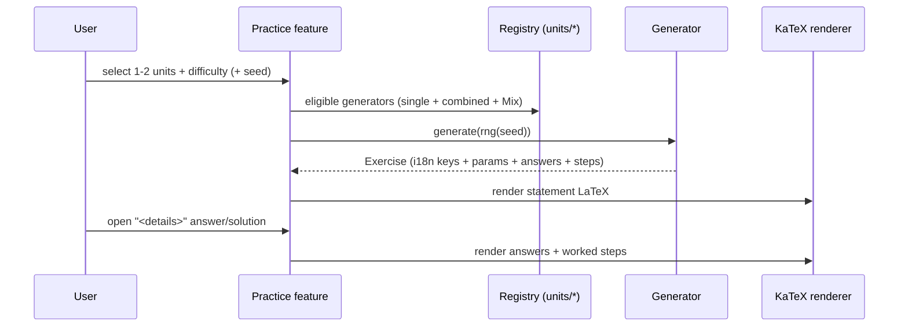

# Architecture / Arquitectura

> Living document. Kept in English + Spanish summaries as the project requires.
> Documento vivo. Se mantiene en inglés + resúmenes en español según exige el proyecto.

## Overview / Resumen

Mathestudiatics is a **fully static SPA**: no backend, no accounts, no cookies.
Everything the app needs is computed in the browser and stored locally (preferences
in `localStorage`, study data in IndexedDB).

Mathestudiatics es una **SPA totalmente estática**: sin backend, sin cuentas, sin
cookies. Todo se computa en el navegador y se guarda localmente (preferencias en
`localStorage`, datos de estudio en IndexedDB).

## Layers / Capas

```mermaid
flowchart TD
  subgraph app ["app/ — shell"]
    Router[Router + routes]
    Providers[i18n + theme + storage providers]
    Layout[Layout: nav, footer, a11y landmarks]
  end

  subgraph features ["features/ — user-facing features"]
    Practice[Practice: selector + exercise card]
    Whiteboard[Whiteboard: objects + canvas]
    Calculator[Calculator: parser + UI]
    Study[Study: theory reader]
    GeoGebra[GeoGebra: quick launch]
  end

  subgraph content ["content/ — pure data + logic"]
    Schema[schema.ts: types + zod]
    Blocks[blocks/: composable builders]
    Units[units/*/index.ts: generators]
    Theory[units/*/theory.{es,en}.md]
  end

  subgraph shared ["shared/ — cross-cutting"]
    I18n[i18n es/en]
    Rng[Seeded RNG]
    Storage[localStorage + IndexedDB]
    UI[UI primitives + MathTex]
  end

  Router --> Practice
  Router --> Whiteboard
  Router --> Calculator
  Router --> Study
  Practice --> Schema
  Practice --> Units
  Units --> Blocks
  Units --> Rng
  Study --> Theory
  Practice --> Storage
  Whiteboard --> Storage
  Practice --> I18n
  Study --> I18n
```

## Data flow: exercise generation / Flujo de datos: generación de ejercicios



## Content packs / Paquetes de contenido

A unit is a folder under `src/content/units/`; the registry discovers it automatically:

```
src/content/units/<unit>/index.ts        # default-exports a UnitDefinition
src/content/units/<unit>/generators/*.ts # pure, seeded exercise generators
```

Each generator returns bilingual templates plus machine-checkable answers and worked
steps. Tests run every generator across seeds and verify the answers with an
independent LaTeX oracle — see [ADR 0003](adr/0003-content-packs-and-seeded-generators/README.md).

Cada unidad es una carpeta bajo `src/content/units/`; el registro la descubre sola.
Cada generador devuelve plantillas bilingües con respuestas verificables y pasos
resueltos; los tests validan las respuestas con un oráculo de LaTeX independiente.

## Key decisions / Decisiones clave

| Topic                               | ADR                                                                |
| ----------------------------------- | ------------------------------------------------------------------ |
| Static SPA on Vite + React          | [ADR 0001](adr/0001-static-react-spa-vite/README.md)               |
| Hash routing on GitHub Pages        | [ADR 0002](adr/0002-hash-routing-github-pages/README.md)           |
| Content packs and seeded generators | [ADR 0003](adr/0003-content-packs-and-seeded-generators/README.md) |
| SVG whiteboard with an object model | [ADR 0004](adr/0004-svg-whiteboard-object-model/README.md)         |

## Non-functional constraints / Restricciones no funcionales

- **A11y:** WCAG 2.2 AA; axe in unit tests and E2E; keyboard-only flows.
- **Performance:** route-level code splitting; self-hosted fonts; budgets enforced in CI.
- **Security:** no `eval`, no raw HTML from content, strict CSP meta on builds, no third-party requests.
- **Privacy:** no telemetry; everything on-device; exports are explicit user actions.
- **i18n:** ES default, EN toggle; all UI strings keyed and parity-tested.
